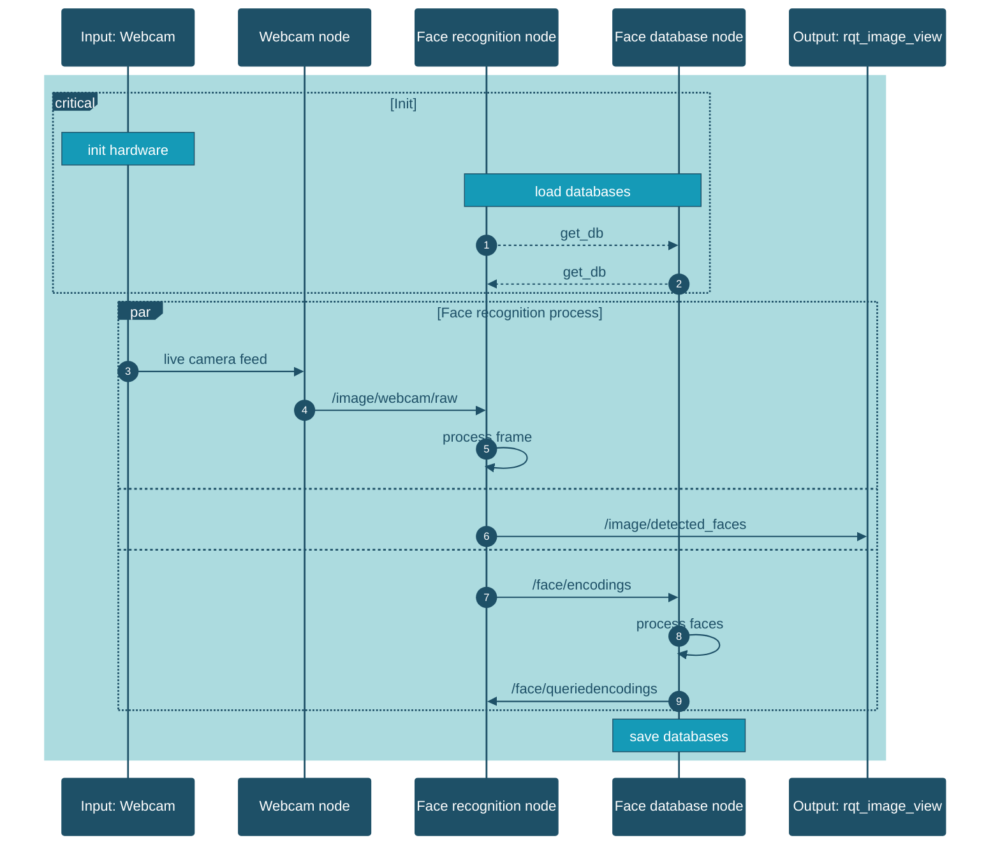

```mermaid
%%{init: {'theme': 'base','themeVariables': {'darkMode':'false','background':'#fff', 'primaryColor':'#1e5067', 'primaryBorderColor':'#1e5067', 'primaryTextColor': '#fff', 'secondaryColor':'#6BB6C7', 'tertiaryColor':'#c1faff', 'tertiaryBorderColor':'#000000', 'clusterBkg':'#159ab7', 'signalColor':'#1e5067', 'signalTextColor':'#1e5067', 'loopTextColor':'#1e5067', 'noteBkgColor':'#159ab7', 'noteTextColor':'#fff', 'noteBorderColor':'#1e5067', 'nodeTextColor':'64px'}}}%%
sequenceDiagram
    autonumber
    participant wc as Input: Webcam
    participant wcn as Webcam node
    participant frn as Face recognition node
    participant dbn as Face database node
    participant rqt as Output: rqt_image_view

    rect rgb(172, 219, 223)
        critical Init
            Note over wc: init hardware
            Note over dbn, frn: load databases
            frn -->> dbn: get_db
            dbn -->> frn: get_db
        end
        par Face recognition process
            wc ->> wcn: live camera feed
            wcn ->>frn: /image/webcam/raw
            frn ->> frn: process frame
        and
            frn ->> rqt: /image/detected_faces
        and
            frn ->> dbn: /face/encodings
            dbn ->> dbn: process faces
            dbn ->> frn: /face/queriedencodings
        end
        Note over dbn: save databases
    end
```
