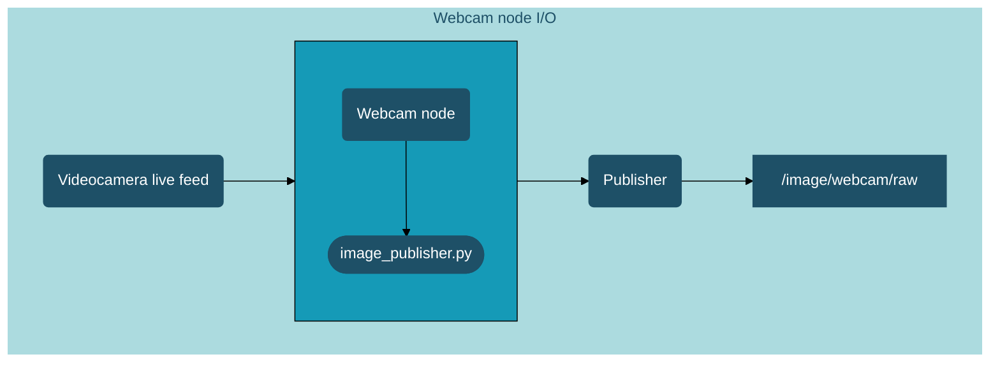
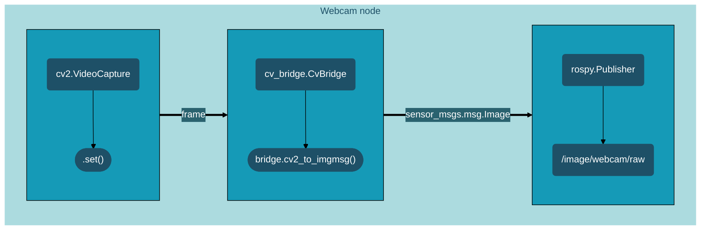
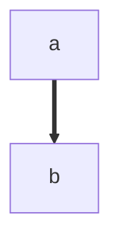

ROS nodeok
<!-- #c24c48
#df8395
#edbdd4
#fff7ff
#c7c6df
#7d9dbe
#067891 -->
>

https://mycolor.space/?hex=%23159AB7&sub=1
classDef node fill:#1e5067,stroke:#333,stroke-width:0px,color:#fff;
    style main fill:#acdbdf,stroke:#333,stroke-width:0px,color:#1e5067;
        style videocapture fill:#159ab7,stroke:#333,stroke-width:2px;
        style cvbridge fill:#159ab7,stroke:#333,stroke-width:2px;
        style pub fill:#159ab7,stroke:#333,stroke-width:2px;

webcam node basic io

face_recognition core node

database ndoe

