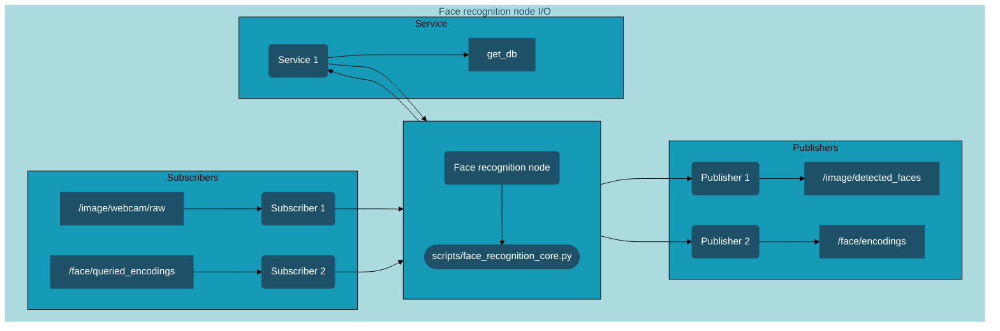
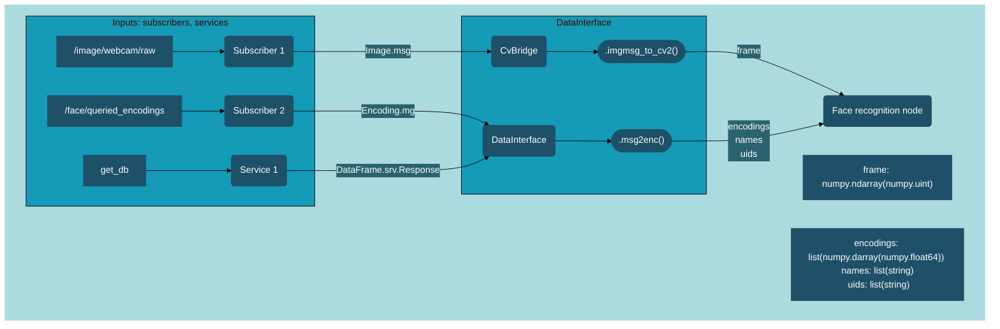
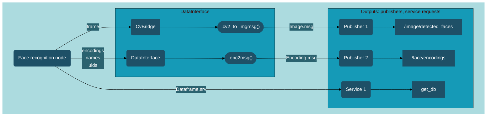

face recognition node basic io

face recognition data interface input


face recognition data interface output



<!-- 
```mermaid
%%{init: {'theme': 'base','themeVariables': {'darkMode':'false','background':'#fff', 'primaryColor':'#1e5067', 'primaryBorderColor':'#000000', 'primaryTextColor': '#fff', 'secondaryColor':'#6BB6C7', 'tertiaryColor':'#c1faff', 'tertiaryBorderColor':'#000000', 'clusterBkg':'#159ab7'}}}%%
classDiagram
    class Face_publisher{
        self.datainterface
        self.imageProcessor
        self.bridge
        self.tolerance
        self.image_pub
        self.encoding_pub
        self.image_sub
        self.update_cache_sub
    }
``` -->