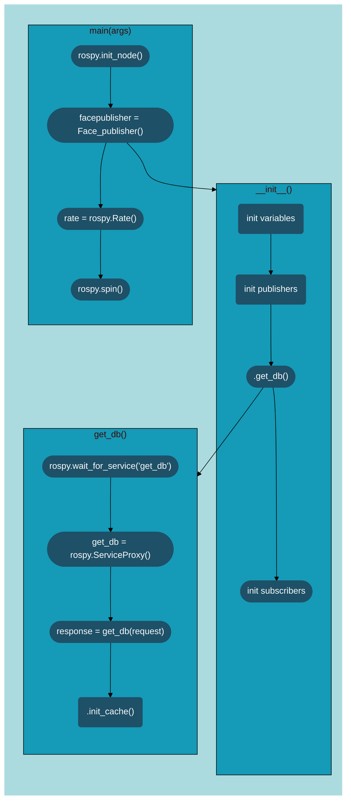
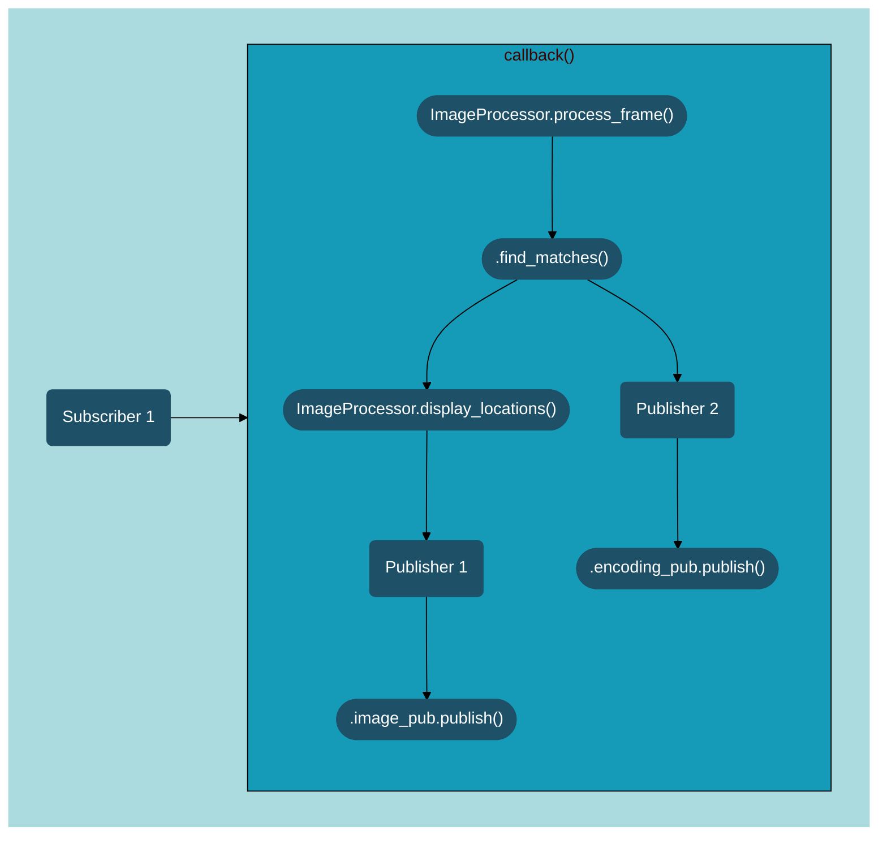

face recognition node internal process

```mermaid
%%{init: {'theme': 'base','themeVariables': {'darkMode':'false','background':'#fff', 'primaryColor':'#1e5067', 'primaryBorderColor':'#1e5067', 'primaryTextColor': '#fff', 'secondaryColor':'#6BB6C7', 'tertiaryColor':'#c1faff', 'tertiaryBorderColor':'#000000', 'clusterBkg':'#159ab7'}}}%%
flowchart TB
    subgraph bug [ ]
    style bug fill:#acdbdf,stroke:#333,stroke-width:0px,color:#1e5067;

    iv(init variables)
    ib(init publishers)
    gdb([".get_db()"])
    is(["init subscribers"])
        direction TB
        subgraph main ["main(args) \n"]
            ri(["rospy.init_node()"]) 
            fp(["facepublisher = Face_publisher()"])
            rt(["rate = rospy.Rate()"])
            rs(["rospy.spin()"])
            ri --> fp --> rt --> rs
        end
        fp --> init
        subgraph init ["__init__()"]
            direction TB
            iv --> ib --> gdb --> is
        end

        gdb --> get_db
        subgraph get_db ["get_db()"]
            direction TB
            wfs(["rospy.wait_for_service('get_db')"])
            gd1(["get_db = rospy.ServiceProxy()"])
            r(["response = get_db(request)"])
            c(".init_cache()")
            wfs --> gd1 --> r --> c
        end

    end
```

```mermaid
%%{init: {'theme': 'base','themeVariables': {'darkMode':'false','background':'#fff', 'primaryColor':'#1e5067', 'primaryBorderColor':'#1e5067', 'primaryTextColor': '#fff', 'secondaryColor':'#6BB6C7', 'tertiaryColor':'#c1faff', 'tertiaryBorderColor':'#000000', 'clusterBkg':'#159ab7'}}}%%
flowchart TB
    subgraph main0 [ ]
    style main0 fill:#acdbdf,stroke:#333,stroke-width:0px,color:#1e5067;
    direction LR
    sub1("Subscriber 1")
    sub1 --> callback
        subgraph callback ["callback()"]
        direction TB
        c0(["ImageProcessor.process_frame()"])
        c1([".find_matches()"])
        c2(["ImageProcessor.display_locations()"])
        c3("Publisher 1")
        c4("Publisher 2")
        c31([".image_pub.publish()"])
        c41([".encoding_pub.publish()"])
        c0 --> c1 --> c2 --> c3 --> c31
        c1 --> c4 --> c41
        end
    end
```