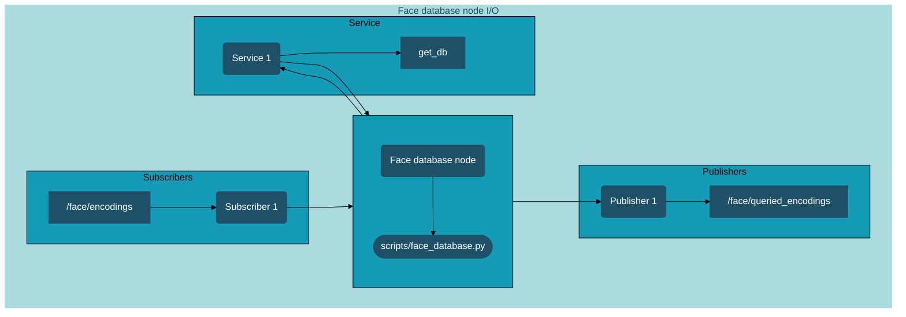
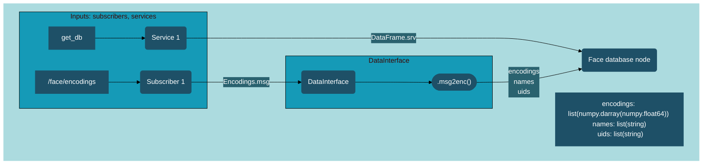
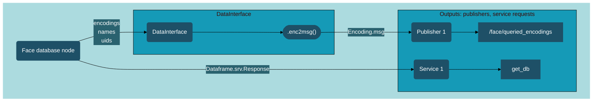

face database node basic io

```mermaid
%%{init: {'theme': 'base','themeVariables': {'darkMode':'false','background':'#fff', 'primaryColor':'#1e5067', 'primaryBorderColor':'#1e5067', 'primaryTextColor': '#fff', 'secondaryColor':'#6BB6C7', 'tertiaryColor':'#c1faff', 'tertiaryBorderColor':'#000000', 'clusterBkg':'#159ab7'}}}%%
flowchart TB
    topic1["/face/encodings"]
    sub1("Subscriber 1")

    wc_node("Face database node")
    ip(["scripts/face_database.py"])
    pub1("Publisher 1")
    topic3["/face/queried_encodings"]

    service("Service 1")
    server[get_db]


    subgraph wc_i [Face database node I/O]
    direction LR
        style wc_i fill:#acdbdf,stroke:#333,stroke-width:0px,color:#1e5067;
        subgraph sub [Subscribers]
            direction TB
            topic1 --> sub1
        end
        sub1 --> fr_node_g
        subgraph fr_node_g [ ]
            wc_node --> ip
        end
        fr_node_g --> pub1
        subgraph pub [Publishers]
            direction LR
            pub1 --> topic3
        end
        fr_node_g --> service
        service --> fr_node_g
        subgraph serv [Service]
        service --> server
        end
    end
```
face database data <-- interface input

```mermaid
%%{init: {'theme': 'base','themeVariables': {'darkMode':'false','background':'#fff', 'primaryColor':'#1e5067', 'primaryBorderColor':'#1e5067', 'primaryTextColor': '#fff', 'secondaryColor':'#6BB6C7', 'tertiaryColor':'#c1faff', 'tertiaryBorderColor':'#000000', 'clusterBkg':'#159ab7'}}}%%
flowchart LR
    topic1["/face/encodings"]
    sub1("Subscriber 1")

    server["get_db"]
    service("Service 1")

    wc_node("Face database node")

    di("DataInterface")
    di2([".msg2enc()"])

    subgraph wc_i [ ]
        direction LR
        style wc_i fill:#acdbdf,stroke:#333,stroke-width:0px,color:#1e5067;
        subgraph sub [Inputs: subscribers, services]
            direction TB
            topic1 --> sub1
            server --> service
        end
        sub1 -- Encodings.msg --> di
        service --  DataFrame.srv --> wc_node

        subgraph di_node [DataInterface]
            direction TB
            di -->di2
        end
        di2 -->|"encodings \n names \n uids"| wc_node
        enc["encodings: list(numpy.darray(numpy.float64)) \n names: list(string) \n uids: list(string)"]

    end
```

face database data --> interface output

```mermaid
%%{init: {'theme': 'base','themeVariables': {'darkMode':'false','background':'#fff', 'primaryColor':'#1e5067', 'primaryBorderColor':'#1e5067', 'primaryTextColor': '#fff', 'secondaryColor':'#6BB6C7', 'tertiaryColor':'#c1faff', 'tertiaryBorderColor':'#000000', 'clusterBkg':'#159ab7'}}}%%
flowchart TB
    fr_node("Face database node")

    pub2("Publisher 1")
    topic4["/face/queried_encodings"]
    service("Service 1")
    server[get_db]
    di("DataInterface")
    di2([".enc2msg()"])


    subgraph wc_o [ ]
    direction LR
        style wc_o fill:#acdbdf,stroke:#333,stroke-width:0px,color:#1e5067;

        fr_node -->|"encodings \n names \n uids"| di
        fr_node -->|Dataframe.srv.Response| service
        subgraph di_node [DataInterface]
            direction TB
            di -->di2
        end
        di2 -- Encoding.msg --> pub2
        subgraph pub [Outputs: publishers, service requests]
            direction LR
            pub2 --> topic4
            service --> server
        end
    end
```