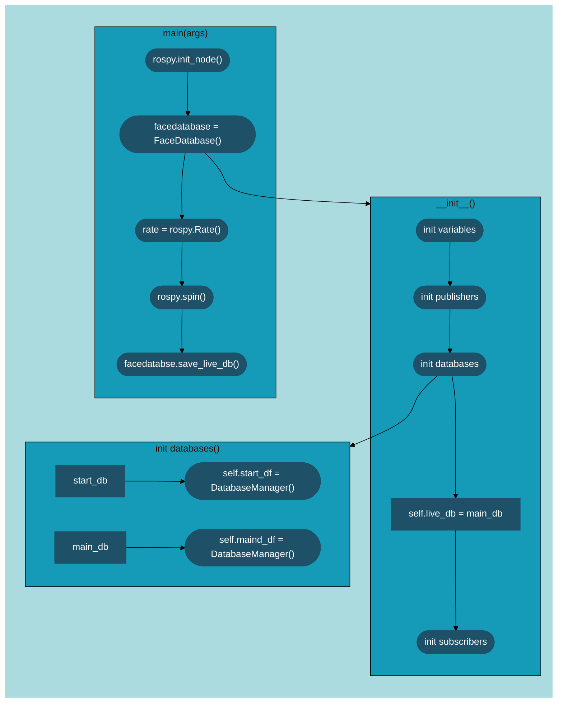
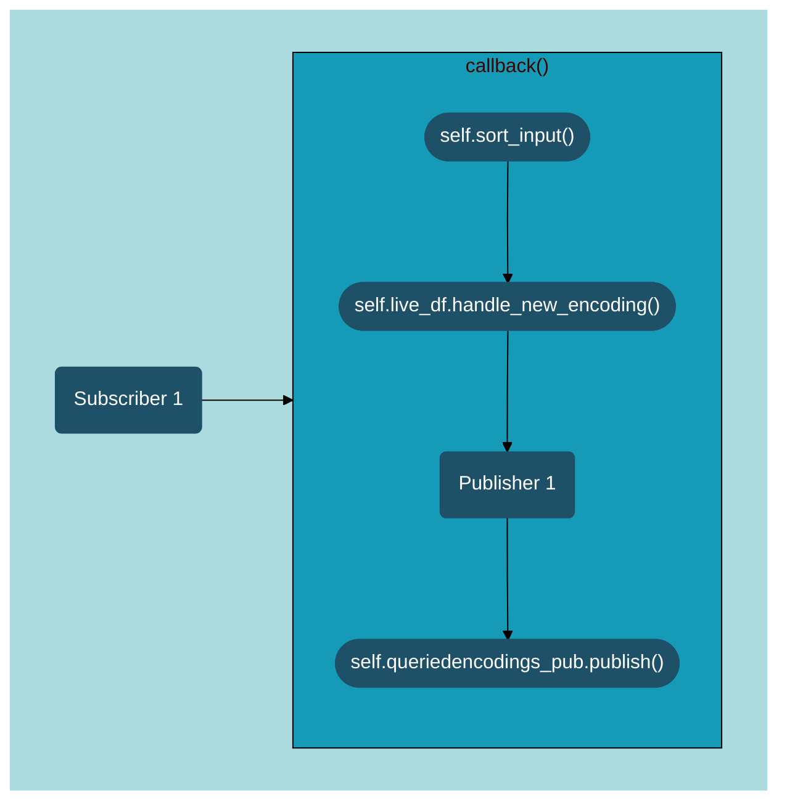
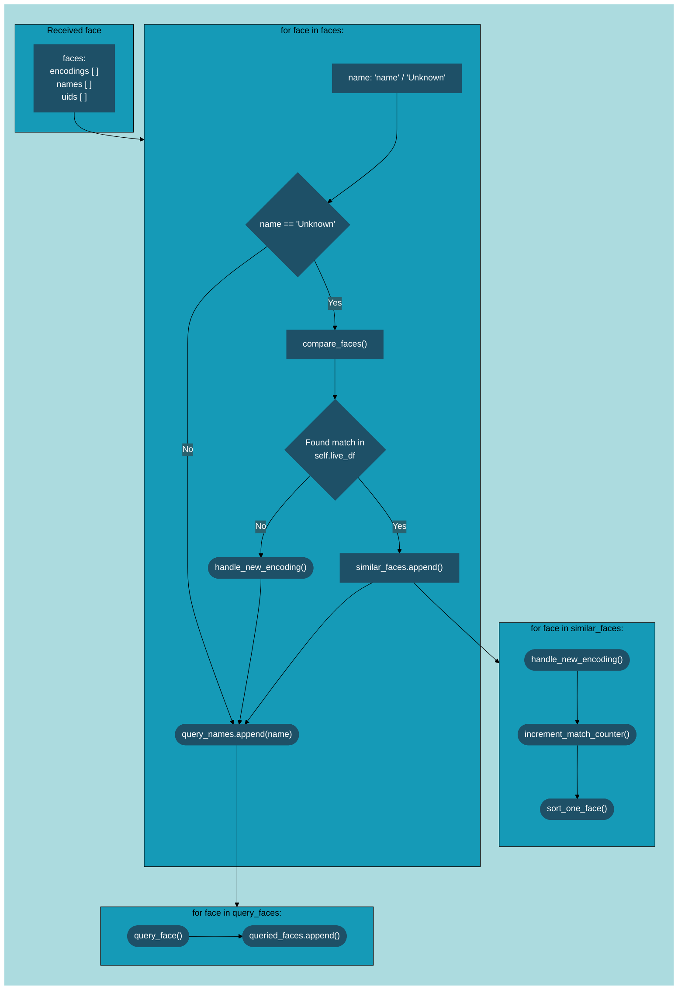

face recognition node internal process

```mermaid
%%{init: {'theme': 'base','themeVariables': {'darkMode':'false','background':'#fff', 'primaryColor':'#1e5067', 'primaryBorderColor':'#1e5067', 'primaryTextColor': '#fff', 'secondaryColor':'#6BB6C7', 'tertiaryColor':'#c1faff', 'tertiaryBorderColor':'#000000', 'clusterBkg':'#159ab7'}}}%%
flowchart TB
    subgraph bug [ ]
    style bug fill:#acdbdf,stroke:#333,stroke-width:0px,color:#1e5067;

    
        direction TB
        subgraph main ["main(args) \n"]
            ri(["rospy.init_node()"]) 
            fp(["facedatabase = FaceDatabase()"])
            rt(["rate = rospy.Rate()"])
            rs(["rospy.spin()"])
            ri --> fp --> rt --> rs
            rs --> die(["facedatabse.save_live_db()"])
        end
        fp --> init
        subgraph init ["__init__()"]
            iv([init variables])
            ib([init publishers])
            gdb(["init databases"])
            is(["init subscribers"])
            direction TB
            iv --> ib --> gdb --> ldb["self.live_db = main_db"]--> is
        end

        gdb --> init_db
        subgraph init_db ["init databases()"]
            direction LR
            start_db --> sdb2(["self.start_df = DatabaseManager()"])
            main_db --> mdb2(["self.maind_df = DatabaseManager()"])
        end
    end
```

```mermaid
%%{init: {'theme': 'base','themeVariables': {'darkMode':'false','background':'#fff', 'primaryColor':'#1e5067', 'primaryBorderColor':'#1e5067', 'primaryTextColor': '#fff', 'secondaryColor':'#6BB6C7', 'tertiaryColor':'#c1faff', 'tertiaryBorderColor':'#000000', 'clusterBkg':'#159ab7'}}}%%
flowchart TB
    subgraph main0 [ ]
    style main0 fill:#acdbdf,stroke:#333,stroke-width:0px,color:#1e5067;
    direction LR
    sub1("Subscriber 1")
    sub1 --> callback
        subgraph callback ["callback()"]
        direction TB
        c0(["self.sort_input()"])
        c1(["self.live_df.handle_new_encoding()"])
        c3("Publisher 1")
        c31(["self.queriedencodings_pub.publish()"])
        c0 --> c1 --> c3 --> c31
        end
    end
```

one callback cycle sorting names

```mermaid
%%{init: {'theme': 'base','themeVariables': {'darkMode':'false','background':'#fff', 'primaryColor':'#1e5067', 'primaryBorderColor':'#1e5067', 'primaryTextColor': '#fff', 'secondaryColor':'#6BB6C7', 'tertiaryColor':'#fff', 'tertiaryBorderColor':'#000000', 'clusterBkg':'#159ab7'}}}%%
flowchart TB
    subgraph manage_input [ ]
    style manage_input fill:#acdbdf,stroke:#333,stroke-width:0px,color:#1e5067;
    direction TB
        subgraph input ["Received face"]
            data["faces: \n encodings [ ] \n names [ ] \n uids [ ]"]
        end

        data --> for1

        subgraph for1 ["for face in faces:"]
            if1{"name == 'Unknown'"}
            name["name: 'name' / 'Unknown'"] --> if1
            if1 -- Yes --> yes["compare_faces()"] --> match{"Found match in \n self.live_df"}
            match -- Yes --> foundmatch["similar_faces.append()"] --> qn
            match -- No --> h1(["handle_new_encoding()"]) --> qn
            if1 -- No --> qn(["query_names.append(name)"])
            end

        foundmatch --> for2

        subgraph for2 ["for face in similar_faces:"]
            direction TB
            h2(["handle_new_encoding()"]) --> m1(["increment_match_counter()"]) --> s1(["sort_one_face()"])
        end

        qn --> for3

        subgraph for3 ["for face in query_faces:"]
            qn2(["query_face()"]) --> qn3(["queried_faces.append()"])
        end
    end
```