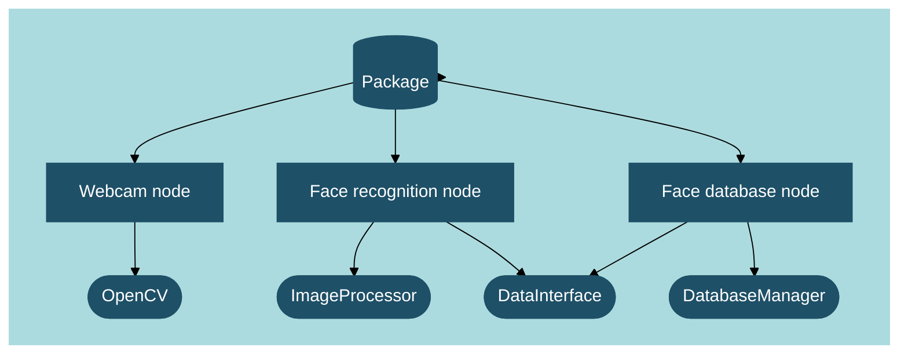
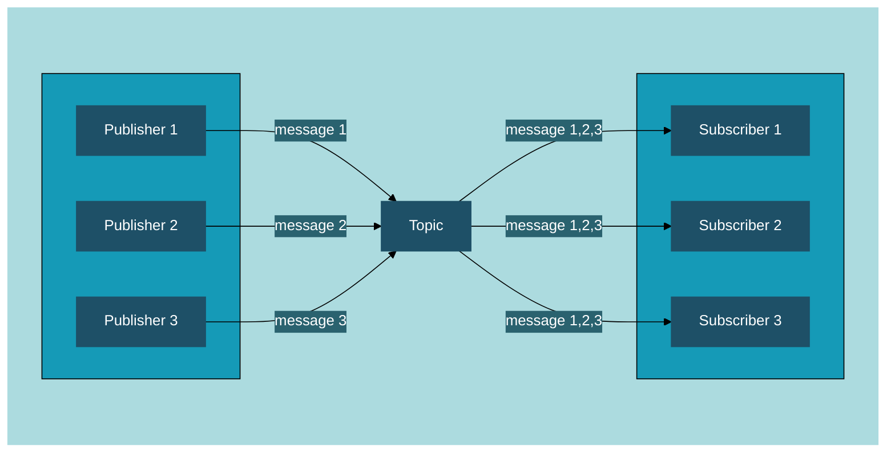
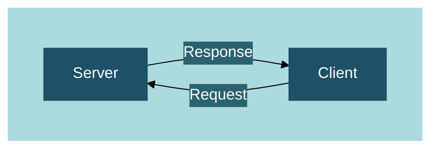

```mermaid
%%{init: {'theme': 'base','themeVariables': {'darkMode':'false','background':'#fff', 'primaryColor':'#1e5067', 'primaryBorderColor':'#1e5067', 'primaryTextColor': '#fff', 'secondaryColor':'#6BB6C7', 'tertiaryColor':'#fff', 'tertiaryBorderColor':'#000000', 'clusterBkg':'#159ab7'}}}%%
flowchart TB
    pa[("Package")]
    wcn["Webcam node"]
    frn["Face recognition node"]
    dbn["Face database node"]
    package --> pa
    subgraph package [ ]
    style package fill:#acdbdf,stroke:#333,stroke-width:0px,color:#1e5067;
    direction TB
    pa --> wcn --> cv2(["OpenCV"])
    frn --> ip(["ImageProcessor"])
    pa --> frn --> da(["DataInterface"])
    pa --> dbn --> da
    dbn --> dbm(["DatabaseManager"])
end
```

```mermaid
%%{init: {'theme': 'base','themeVariables': {'darkMode':'false','background':'#fff', 'primaryColor':'#1e5067', 'primaryBorderColor':'#1e5067', 'primaryTextColor': '#fff', 'secondaryColor':'#6BB6C7', 'tertiaryColor':'#fff', 'tertiaryBorderColor':'#000000', 'clusterBkg':'#159ab7'}}}%%
flowchart LR
    subgraph main [ ]
    direction LR
    style main fill:#acdbdf,stroke:#333,stroke-width:0px,color:#1e5067;
        subgraph pub [ ]
        p1[Publisher 1]
        p2[Publisher 2] 
        p3[Publisher 3]
        end
        p1 --"message 1 "-->t
        p2 --"message 2 "-->t
        p3 --"message 3 "-->t
        t[Topic]
        t --"message 1,2,3"-->s1
        t --"message 1,2,3"-->s2
        t --"message 1,2,3"-->s3
        subgraph sub [ ]
        s1[Subscriber 1]
        s2[Subscriber 2]
        s3[Subscriber 3]
        end
    end
```

```mermaid
%%{init: {'theme': 'base','themeVariables': {'darkMode':'false','background':'#fff', 'primaryColor':'#1e5067', 'primaryBorderColor':'#1e5067', 'primaryTextColor': '#fff', 'secondaryColor':'#6BB6C7', 'tertiaryColor':'#fff', 'tertiaryBorderColor':'#000000', 'clusterBkg':'#159ab7'}}}%%
flowchart LR
    subgraph main [ ]
    direction LR
    style main fill:#acdbdf,stroke:#333,stroke-width:0px,color:#1e5067;
    s --Response--> c

    c[Client] --Request--> s[Server]

    end
```